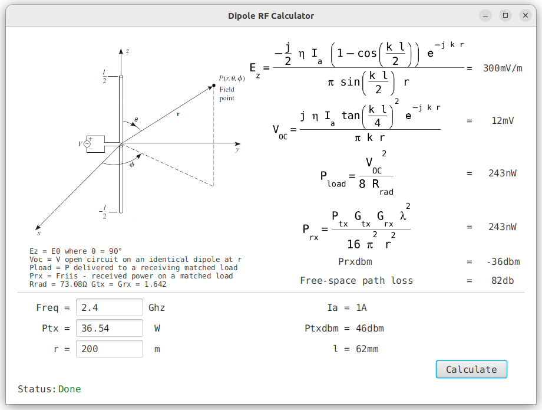

Dipole RF Calculator
--


### Description
Calculates Ez field from a half-wave dipole antenna at distance r.<br/>
Calculates VOC (V open circuit) from the incident field Ez on an identical receiving dipole antenna at distance r. <br/>
Calculates Pload (power delivered to a perfectly matched load) by the incident field Ez on an identical receiving dipole antenna at distance r. <br/>
Calculates Prx (power received to a perfectly matched load) via Friis formula.

### Other features
Calculates dipole length from input frequency for a quick antenna design.<br/>
Calculates dipole feed current Ia from input power.<br/>
Converts both Tx and Rx power to dbm for a quick link budget design.<br/>
Calculates the free space path loss for a quick link budget design. (this includes both Tx and Rx 2.15db gain)<br/>
Computed results are displayed in engineering format.<br/>

### Quick math
First the following assumptions are made:
* dipole antenna has a half-wave length meaning radiation resistance Rrad = 73.08 &#937;.
* Ez represents the electric field in Cartesian coordinates  and is identical with E&#952; with &#952;=90&#176; in spherical coordinates.
* VOC, Pload and Prx are calculated on an identical receiving dipole antenna and polarization at distance r.
* both Tx and Rx dipoles have a gain of 2.15db or 1.642.

Ez formula below contain the classic Ia current, space impedance and decreasing with distance r.<br>
The trigonometric terms are caused by the sinusoidal Ia current distribution on the antenna (doughnut shape).<br>

<br/>

VOC formula below is the Ez*l but because the receiving antenna also has a sinusoidal current distribution it gets multiplied again by the trigonometric terms above.<br/>
This leads to the tan function squared because of the 2 identical dipoles.<br/>

<br/>

Pload formula below is constructed from converting to rms and perfectly matching the load to the antenna.<br/>

<br/>

### Verification 1 ###
Friis formula below is used to verify all calculations above.<br/>
It takes into consideration both dipole's effective aperture area.<br/>
Given freq=2.4GHz, Ptx=36.54W, r=200m our calculator gives Pload=243nW. Using the Friis formula below we also get Prx=243nW.<br> 

<br/>

### Verification 2 ###
CST studio was used to calculate the electric field for freq=2.4GHz, Ptx=36.54W, r=200m.<br/>
This resulted in 0.2989V/m (screenshot below) while our application returned 0.3V/m (see screenshot at the end of this file) which is pretty good for our sinusoidal current distribution approximation.<br/>

<br/>

### Usage
Requires JDK 17.<br/>
To run the project use the following command:<br/>
```
./gradlew clean run
```
For a java distribution run the command below and check folder: ./build/install/dipole-rf-calculator/bin<br/>
```
./gradlew clean installDist
```
For native OS executable run the command below and check folder: ./build/image/bin
```
sudo apt-get install binutils //only for linux
./gradlew clean jlink 
```
> [!TIP]
> Math formulas in LaTeX format can be found in file /formulas.tex

> [!TIP]
> I case you have older JDK version than JDK 17 and you are using IntelliJIDEA as IDE make sure Gradle JVM is set to JDK 17 in:<br/>
> File | Settings | Build, Execution, Deployment | Build Tools | Gradle  -> Gradle JVM

### Screenshot

